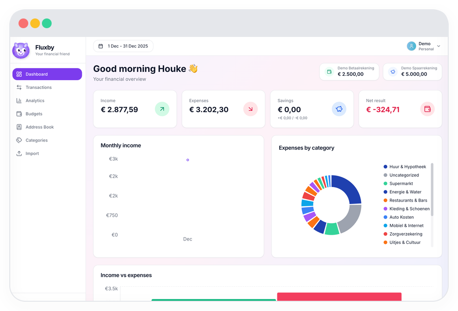
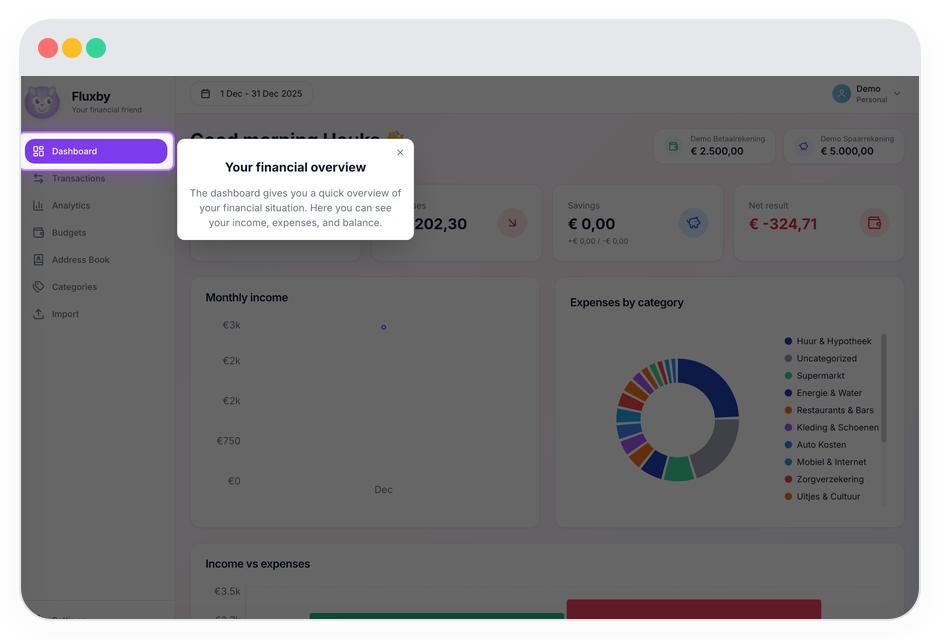
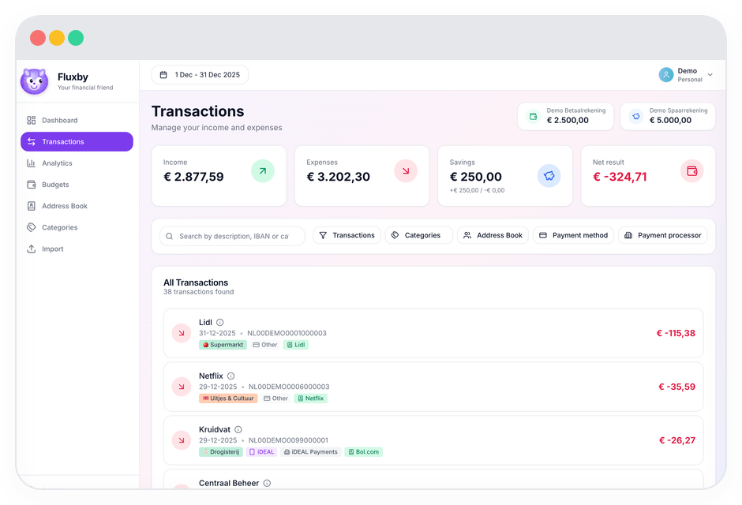
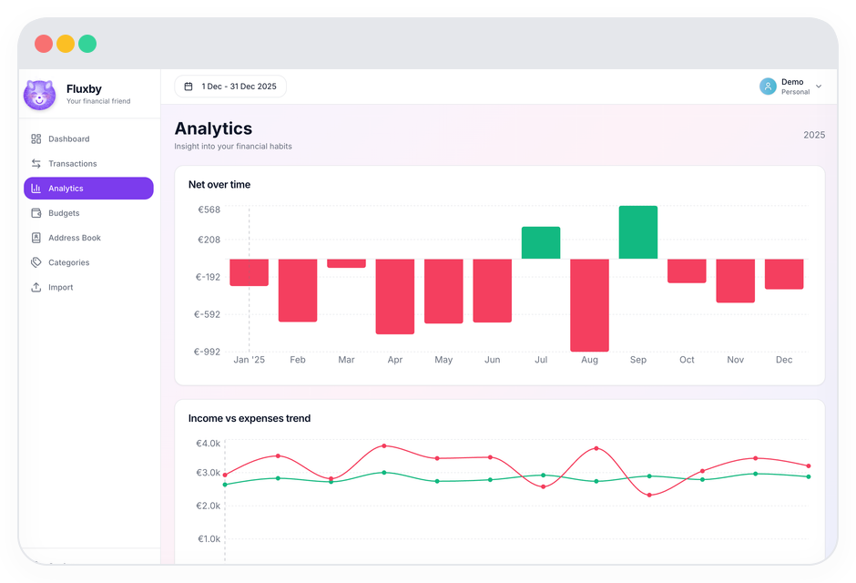
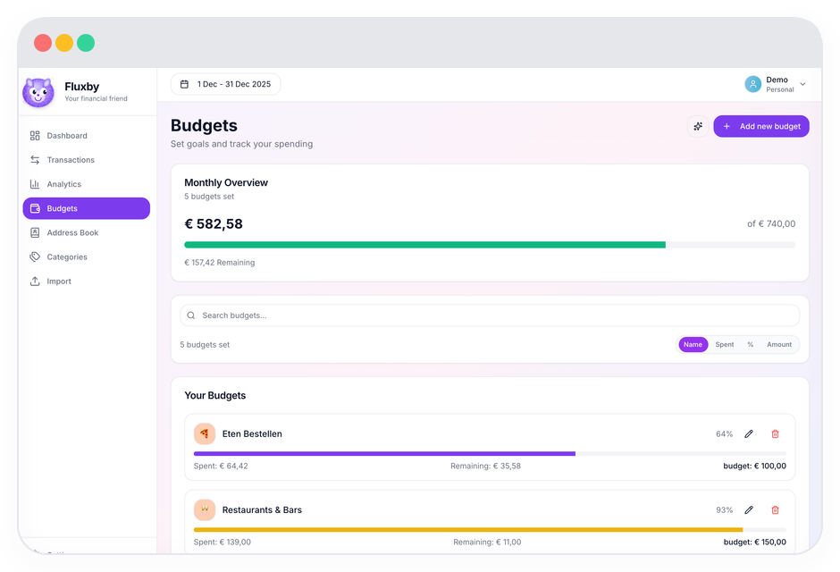
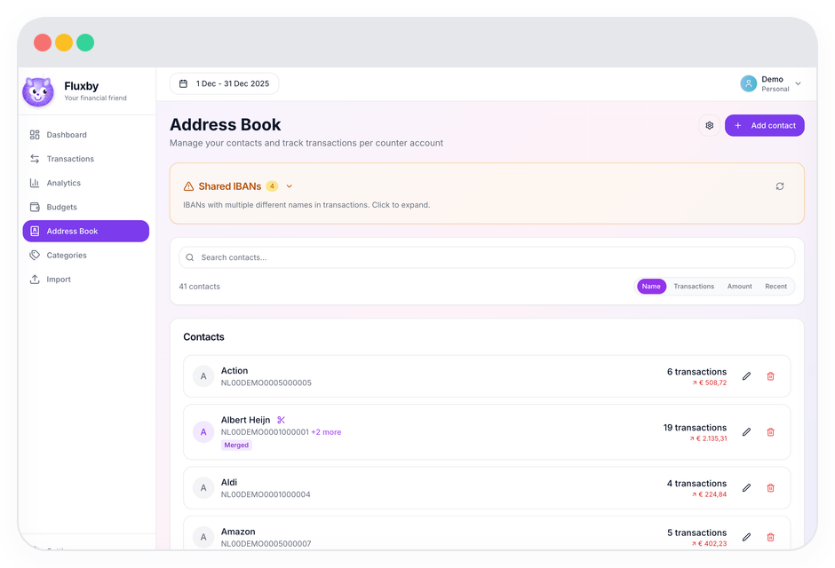
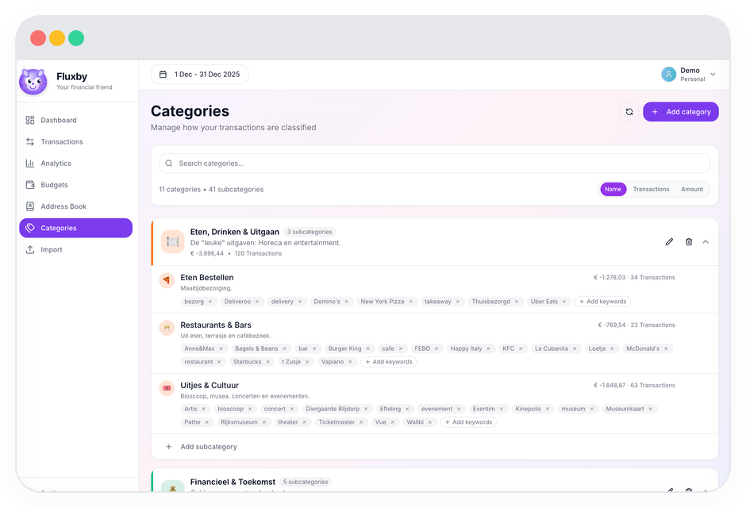
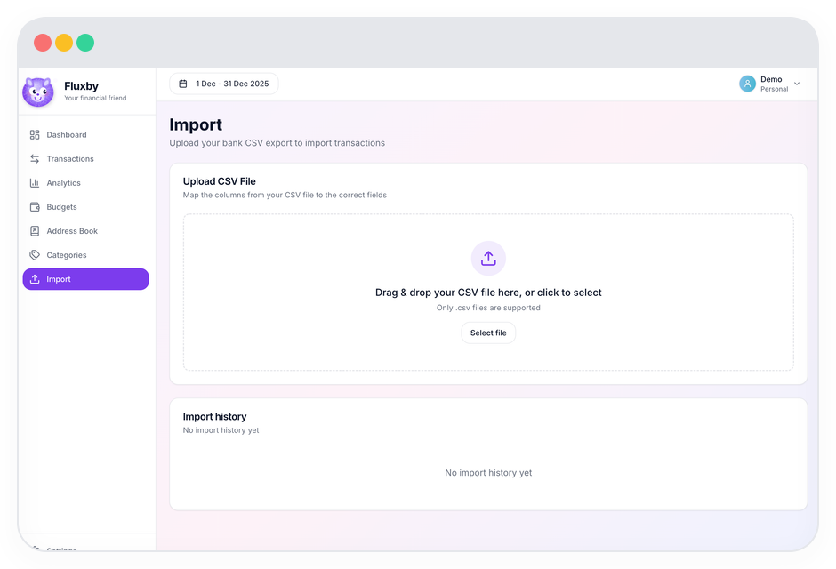

# 💰 Fluxby - Financial Dashboard

A modern, local-first application for visualizing and analyzing your bank data. Upload CSV exports from your bank and instantly gain insights into your finances.



## ✨ Features

- **📊 Clear Dashboard** - View your income, expenses, and balance at a glance
- **📈 Charts & Analytics** - Interactive charts for trends and categories
- **📁 CSV Import** - Easily upload CSV exports from ING (more banks coming)
- **🏷️ Automatic Categorization** - Transactions are automatically categorized
- **📱 Modern Interface** - Clean design with a pleasant user experience
- **🔒 100% Local** - All data stays on your own device
- **🖥️ Desktop App** - Native apps for Windows, macOS, and Linux via Tauri

## 🚀 Quick Start

### Requirements

- Node.js 22 or higher
- npm 10 or higher

### Installation

```bash
# Clone the repository
git clone https://github.com/houke/fluxby.git
cd fluxby

# Install dependencies
npm install

# Start the application
npm run dev
```

The application is now available at:

- **Web App:** http://localhost:5177/app/ (local-first, uses browser OPFS storage)
- **Landing Page:** http://localhost:5177
- **API (for developers only):** http://localhost:3001

> **Note:** The web app uses **OPFS (Origin Private File System)** for local-first storage. No backend server is required - the API is only for developers who want to build custom interfaces.

## 📂 Project Structure

```
fluxby/
├── apps/
│   ├── api/           # Express.js backend (optional, for developers building custom interfaces)
│   ├── web/           # React PWA frontend (uses OPFS for local-first storage)
│   ├── landing/       # Marketing & docs landing page
│   └── tauri/         # Tauri desktop app wrapper
│
└── packages/
    ├── shared/        # Shared types & utilities
    ├── database/      # Universal SQLite layer (OPFS/Tauri/Node)
    └── core/          # Business logic (CSV parsing, analytics)
```

## 🏠 Architecture

### Local-First Design

Fluxby is designed to work entirely in your browser without any server:

- **Web App**: Uses SQLite WASM with OPFS storage - your data stays in your browser
- **Desktop App (Tauri)**: Uses local SQLite storage
- **No Backend Required**: The app works offline and can be hosted on GitHub Pages
- **API Server**: Optional, only for developers building custom integrations

## 📖 Usage

### CSV Import

1. Go to the **Import** page
2. Select your bank (currently only ING supported)
3. Drag your CSV file to the upload field or click to select
4. Transactions are automatically processed and categorized

**Note:**

- Transactions before the current month are only imported once
- When importing data for the current month, existing entries for that month are first deleted

**Unsupported Banks:**

If your bank is not in the supported list, use the **Manual Import** option. This allows you to manually map CSV columns to the required fields (date, amount, description, etc.) for importing your transactions.

### Dashboard

The dashboard shows:

- Total balance across all accounts
- Income and expenses for the current month
- Chart with monthly trends
- Distribution by category
- Recent transactions

### Transactions

- View all transactions in a clear table
- Filter by period, category, or search term
- Sort by date, amount, or description
- Manually adjust categories

### Analytics

- Detailed charts and statistics
- Compare periods
- View spending patterns by category
- Identify trends

### Budgets

- Set budgets per category
- Track your progress throughout the month
- Receive visual feedback when exceeded

### Categories

- Create and manage transaction categories
- Set up automatic categorization rules
- Organize your expenses and income
- View spending breakdown by category

### Address Book

- Manage contacts and payees
- Add notes and details for recurring transactions
- Filter transactions by contact
- Keep track of payment recipients

## 🏦 Supported Banks

| Bank     | Status       |
| -------- | ------------ |
| ING      | ✅ Supported |
| Rabobank | 🔜 Planned   |
| Knab     | 🔜 Planned   |
| ASN      | 🔜 Planned   |

## 🛠️ Technical Stack

### Frontend

- React 19
- TypeScript
- Vite 6
- Tailwind CSS
- Recharts for charts
- TanStack Query & Table

### Backend

- Express.js
- TypeScript
- SQLite (better-sqlite3)
- Multer for file uploads
- PapaParse for CSV parsing

### Desktop (Tauri)

- Tauri 2.0
- Rust backend
- Native file dialogs
- Cross-platform (Windows, macOS, Linux)

### Local-First Architecture

- **SQLite WASM** - Database runs in browser/Tauri
- **OPFS Storage** - Persistent storage in browser sandbox
- **Password Protection** - App locks on idle, password required to unlock
- **Peer-to-Peer Sync** - Device pairing via WebRTC

## 🔒 Security Model

Fluxby uses a **Local-First** security model:

1. **Password Protection** - App locks on idle or browser close
2. **PBKDF2 Hashing** - Password verified via secure hash (100k iterations)
3. **Local Storage** - All data stays in your browser's OPFS sandbox
4. **Auto-Lock** - Session cleared on tab close or idle timeout

Your data never leaves your device.

## 📝 Scripts

```bash
# Start UI development (Landing + Web app)
npm run dev

# Start full local dev (API + Landing + Web app)
npm run dev:all

# Start only the local API server (developer tool)
npm run dev:api

# Start only the Web app (port 5178)
# Use this for Tauri (it needs the Web dev server)
npm run dev:web

# Start Tauri desktop development
npm run dev:tauri

# Build packages
npm run build:packages

# Build web app
npm run build:web

# Generate API documentation
npm run generate:api

# Pre-build check for Tauri
npm run prebuild:tauri

# Build everything
npm run build

# Build a GitHub Pages-ready static folder (dist/)
# Includes landing at / and the app at /app/
npm run build:pages

# Build and serve the static dist/ folder locally
npm run serve:pages

# Build desktop app
npm run build:tauri

# Lint code
npm run lint

# Lint and fix code
npm run lint:fix

# Format code
npm run format

# Type checking
npm run typecheck

# Run tests
npm run test

# Run tests once
npm run test:run

# Run tests with coverage
npm run test:coverage

# Start API server
npm run start

# Create a release (interactive)
npm run release

# Preview release (dry run)
npm run release:dry
```

### Dev script differences

- `dev:web` starts only the React PWA in [apps/web](apps/web) on port `5178`.
  - Use it when developing the app UI itself (and for Tauri dev).
  - In normal browser dev, the landing dev server proxies this app under `http://localhost:5177/app/`.
- `dev` starts the landing server in [apps/landing](apps/landing) (port `5177`) and the web app server in [apps/web](apps/web) (port `5178`) concurrently.
  - Use it for “full UI” development: landing, docs, help center, and the app under `/app/`.
- `dev:api` starts the optional Express API in [apps/api](apps/api) on port `3001`.
  - Use it only if you’re building integrations/scripts that need the REST API.
- `dev:all` starts `dev:api` + `dev` together.

### What each folder provides

- [apps/landing](apps/landing): marketing site + developer docs (`/docs/*`) + help center (`/help/*`). In dev it proxies `/app` → the web app and `/api` → the API server.
- [apps/web](apps/web): the actual Fluxby app (local-first). Stores its database in browser OPFS and does not require any backend.
- [apps/api](apps/api): optional local REST API (developer tool). Uses its own Node/SQLite database in `data/` and does not connect to the web app's OPFS database.
- [apps/tauri](apps/tauri): desktop wrapper; uses the web app dev server during development.

## 🖥️ Desktop App (Tauri)

Build native desktop apps for Windows, macOS, and Linux:

```bash
# Install Rust (if not already installed)
curl --proto '=https' --tlsv1.2 -sSf https://sh.rustup.rs | sh

# Install Tauri CLI
npm install

# Development
npm run dev:tauri

# Build for production
npm run build:tauri
```

## 🌐 Web Deployment (GitHub Pages)

The web app can be deployed as a PWA to GitHub Pages:

1. Fork this repository
2. Enable GitHub Pages in repository settings
3. Push to main branch - automatic deployment via GitHub Actions

The PWA works fully offline after first load.

## 🖼 Screenshots

A set of screenshots showing the app inside the OSX-style browser frame (generated into `apps/screenshots/`). Each image includes a short description.

-  — Screenshot 1: Dashboard.
-  — Screenshot 2: Onboarding.
-  — Screenshot 3: Transactions.
-  — Screenshot 4: Analytics.
-  — Screenshot 5: Budgets.
-  — Screenshot 6: Address book.
-  — Screenshot 7: Categories.
-  — Screenshot 8: Import.

## 🤝 Contributing

Contributions are welcome! Open an issue or pull request for:

- Bug fixes
- New bank formats
- Feature suggestions
- Documentation improvements

## 📄 License

MIT License - See [LICENSE](LICENSE) for details.

---

<p align="center">
  Made with ❤️ for better financial insights
</p>
